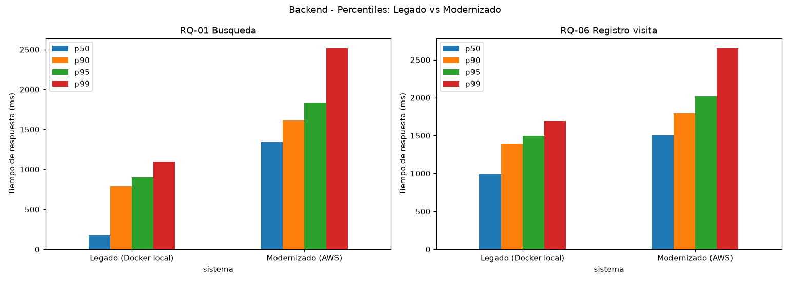
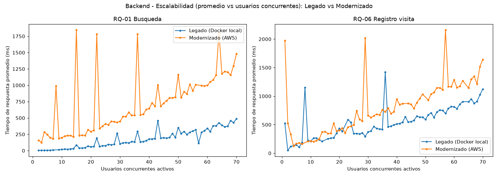
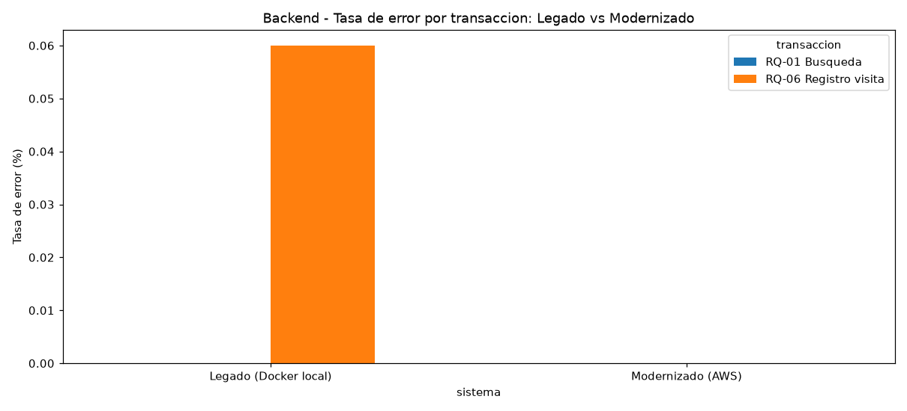
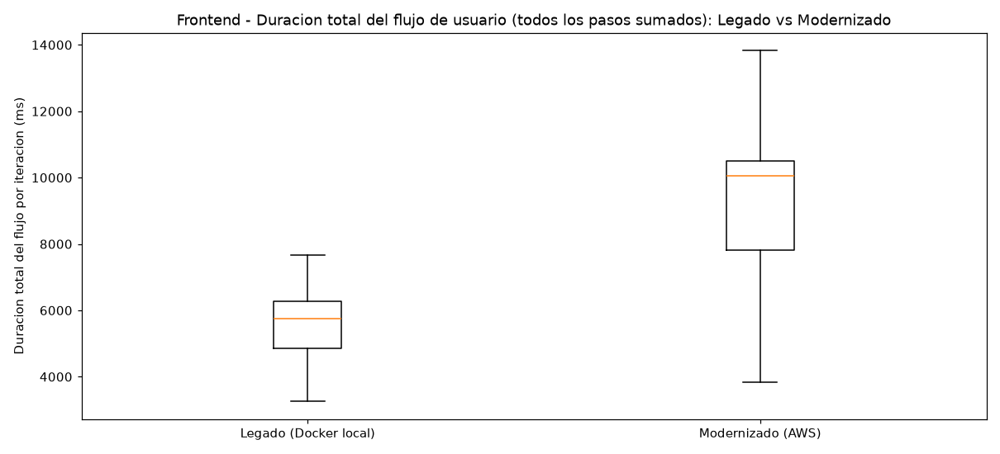

# Comparación de rendimiento — Legado vs. Modernizado

## 1. Qué se comparó

Se contrastan las dos corridas en paralelo (JMeter + Playwright, mismos flujos RQ-01 y RQ-06, mismo ramp-up de 60s y duración de 180s) realizadas sobre:

- **Legado:** Spring PetClinic (Thymeleaf) corriendo en un contenedor Docker local limitado a 2 vCPU / 4 GB (igualando una instancia `t3.medium`), atacado desde la misma máquina (`localhost`).
- **Modernizado:** backend Spring Boot (API REST) en una instancia EC2 `t3.medium` real de AWS, y frontend React servido como sitio estático en un bucket S3, ambos atacados desde una máquina en Colombia sobre internet público.

## 2. ⚠️ Salvedad metodológica — antes de leer los números

El legado corrió en `localhost` (latencia de red prácticamente nula), mientras que el modernizado corrió contra un servidor real en `us-east-1` (Virginia, AWS) desde una máquina fuera de Estados Unidos. **Parte de la diferencia de tiempos absolutos que se ve más abajo se debe a esa latencia de red real (ida y vuelta por internet en cada petición), y no es atribuible únicamente a la arquitectura del sistema.**

Esto no invalida la comparación, pero cambia qué se puede concluir de ella:

- **Sí es válido comparar:** la *forma* de las curvas de escalabilidad (¿qué tan rápido se degrada el tiempo de respuesta al subir la concurrencia?, ¿hay errores?, ¿el frontend deja de responder?).
- **No es directamente válido comparar:** los valores absolutos de tiempo de respuesta (ej. "293 ms" vs "1,150 ms") como si fueran atribuibles solo a Thymeleaf vs. React/API REST, porque incluyen un componente de latencia de red que no está presente en la corrida del legado.

Para una comparación de tiempos absolutos verdaderamente justa haría falta correr el legado también contra un servidor remoto real (o, alternativamente, correr JMeter/Playwright para el modernizado desde una instancia EC2 en la misma región que el backend, eliminando así el componente de latencia de internet).

## 3. Resumen numérico — Backend (JMeter)

| Sistema | Transacción | Peticiones | Promedio | Mediana | p95 | Máximo | Errores |
|---|---|---|---|---|---|---|---|
| Legado (Docker local) | RQ-01 Búsqueda | 25,721 | 293 ms | 176 ms | 897 ms | 1,702 ms | 0 |
| Legado (Docker local) | RQ-06 Registro visita | 3,355 | 905 ms | 990 ms | 1,498 ms | 1,923 ms | 2 |
| Modernizado (AWS) | RQ-01 Búsqueda | 6,593 | 1,151 ms | 1,343 ms | 1,833 ms | 4,043 ms | 0 |
| Modernizado (AWS) | RQ-06 Registro visita | 2,312 | 1,321 ms | 1,506 ms | 2,019 ms | 4,253 ms | 0 |

**Lecturas que sí son justas:**
- **Errores:** el modernizado tuvo **0 errores** en ambas transacciones bajo la misma carga en la que el legado tuvo 2 (backend). Buena señal de robustez, e independiente de la latencia de red.
- **Menor throughput en el modernizado:** con el mismo ramp-up y duración, el modernizado procesó menos peticiones totales (6,593 + 2,312 = 8,905 vs. 25,721 + 3,355 = 29,076 del legado). Esto es esperable: cada petición tarda más en completarse por el viaje de ida y vuelta a AWS, así que en la misma ventana de 180s caben menos peticiones por hilo — no significa necesariamente que el servidor procese más lento internamente.

## 4. Percentiles comparados

**Lectura:** los valores absolutos del modernizado son más altos en ambas transacciones, consistente con el componente de latencia de red descrito en la sección 2.

## 5. Escalabilidad comparada

**Lectura:** esta es la comparación más relevante para el objetivo original (mantenibilidad/escalabilidad). Ambas curvas muestran una tendencia de crecimiento del tiempo de respuesta a medida que aumenta la concurrencia — ninguno de los dos sistemas es "plano". La curva del modernizado se ve más ruidosa (con picos más pronunciados y aislados), lo cual es consistente con variabilidad de latencia de red real (jitter de internet) más que con un problema de arquitectura del backend en sí. No se observa, en esta corrida, evidencia de que el modernizado escale peor que el legado en términos relativos — ambos degradan de forma gradual y sin errores masivos.

## 6. Tasa de error comparada

**Lectura:** el legado tuvo una tasa de error de ~0.06% en RQ-06 (2 de 3,355); el modernizado tuvo 0% en ambas transacciones. Bajo esta carga, el modernizado no mostró ninguna señal de fragilidad adicional pese a la latencia de red real.

## 7. Resumen numérico — Frontend (Playwright)

| Sistema | Iteraciones completas | Promedio del flujo total | Mediana | p95 | Errores |
|---|---|---|---|---|---|
| Legado (Docker local) | 282 | 5,442 ms | 5,747 ms | 6,866 ms | 0 |
| Modernizado (AWS) | 174 | 8,867 ms | 10,061 ms | 11,854 ms | 0 |

> Nota: se compara la **duración total del flujo de usuario** (suma de todos los pasos por iteración) en vez de paso por paso, porque el legado tiene 6 pasos (incluye una página de formulario de búsqueda separada, propia de la navegación server-rendered de Thymeleaf) y el modernizado tiene 5 (es una SPA sin esa página intermedia) — no son directamente equivalentes paso a paso, pero sí lo es el tiempo total que le toma a un usuario completar el flujo de principio a fin.

**Lectura:** el modernizado tardó más en completar el flujo end-to-end (mediana ~10.1s vs ~5.7s), explicado en gran parte por la misma latencia de red de la sección 2 — cada paso involucra al menos una llamada a la API en AWS. Sin embargo, con **0 errores** en 174 iteraciones completas bajo la misma carga concurrente, el frontend modernizado se mantuvo completamente funcional y estable durante toda la prueba, sin bloqueos ni fallos de renderizado.

## 8. Conclusión general

Bajo la misma metodología de carga (ramp-up de 60s, duración de 180s, JMeter y Playwright corriendo en paralelo), ambos sistemas se mantuvieron estables y funcionales, sin errores relevantes:

- **Robustez:** el modernizado tuvo *menos* errores que el legado bajo la misma carga concurrente (0 vs. 2 en backend), tanto en la API REST como en la SPA de React.
- **Escalabilidad relativa:** ambas arquitecturas muestran una degradación gradual y similar en la *forma* de su curva de tiempo de respuesta al aumentar la concurrencia; no hay evidencia en esta corrida de que el modernizado escale peor que el legado.
- **Tiempos absolutos:** el modernizado presenta tiempos de respuesta y de flujo de usuario más altos en términos absolutos, pero esto está confundido con el componente de latencia de red real (AWS `us-east-1` vía internet) que no está presente en la corrida local del legado. **No se puede concluir de estos datos que la arquitectura modernizada sea intrínsecamente más lenta** sin antes aislar ese factor.

**Recomendación para una comparación de tiempos absolutos más rigurosa:** repetir la prueba del legado contra una instancia EC2 real (en vez de Docker local), o repetir la prueba del modernizado generando la carga desde una instancia EC2 en la misma región (`us-east-1`) que el backend, para que ambas corridas compartan condiciones de red comparables.
