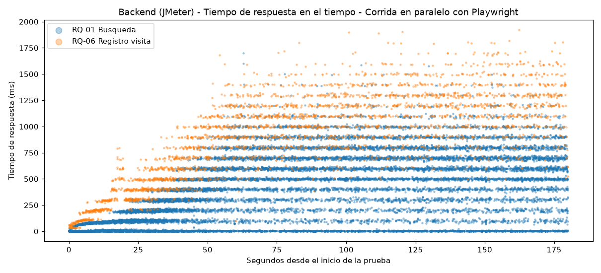
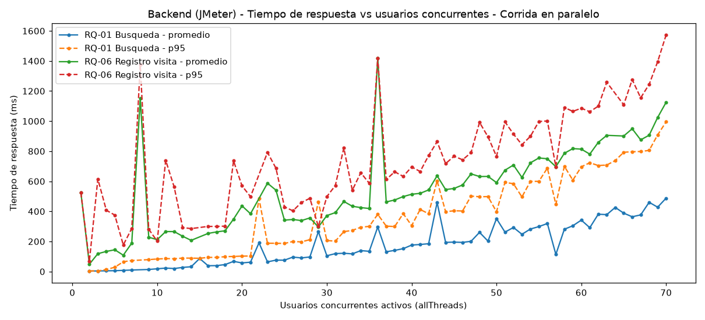
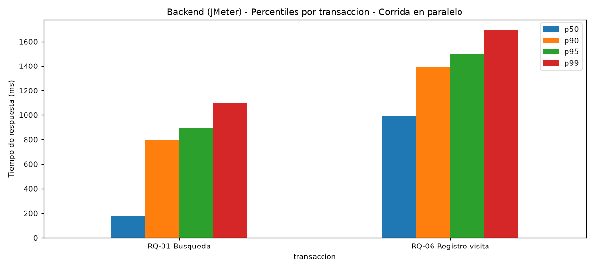
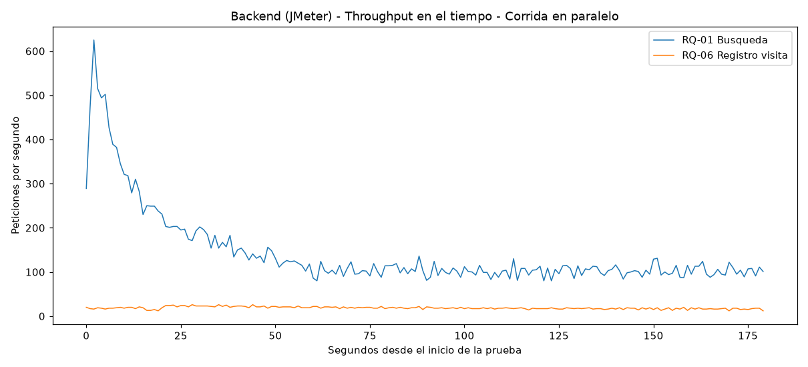
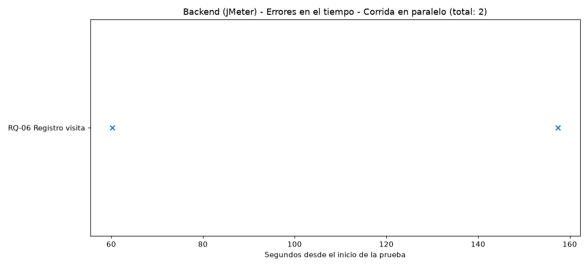
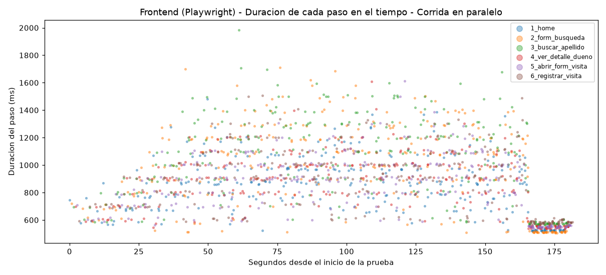
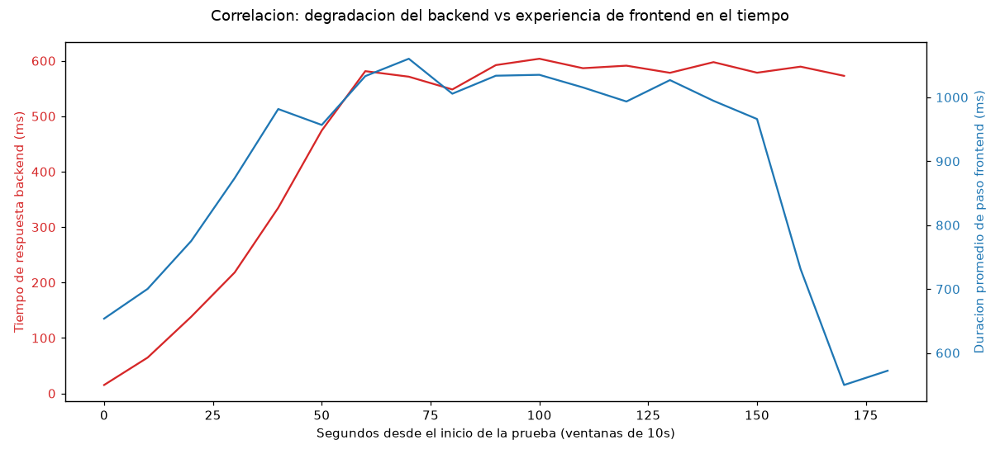

# Resultados y análisis — Pruebas de rendimiento sobre Spring PetClinic (Legado)

## 1. Qué se probó

Se realizaron pruebas de carga sobre la aplicación legado (Spring PetClinic), ejecutando **al mismo tiempo**:

- **JMeter** atacando directamente el backend (RQ-01 búsqueda por apellido, RQ-06 registro de visita), con el `.jmx` `petclinic_load_test_2.jmx`.
- **Playwright** (`playwright_stress_test.js`) navegando la interfaz real con 10 usuarios (navegadores), ramp-up de 60s y duración de 180s — configurado para coincidir exactamente con la ventana de tiempo de JMeter.

Ambas herramientas se lanzaron contra el mismo contenedor Docker `petclinic-t3medium` (limitado a 2 vCPU / 4 GB, igualando una instancia `t3.medium` de AWS), en la misma ventana de ~180 segundos.

**Objetivo:** verificar si la saturación del backend generada por JMeter se traduce en una degradación perceptible de la experiencia real de usuario (medida por Playwright con un navegador de verdad), y no solo en números aislados de peticiones HTTP.

## 2. Resumen numérico — Backend (JMeter)

| Transacción | Peticiones | Promedio | Mediana | p90 | p95 | p99 | Máximo | Errores |
|---|---|---|---|---|---|---|---|---|
| RQ-01 Búsqueda por apellido | 25,721 | 293 ms | 176 ms | 793 ms | 897 ms | 1,096 ms | 1,702 ms | 0 |
| RQ-06 Registro de visita | 3,355 | 905 ms | 990 ms | 1,397 ms | 1,498 ms | 1,695 ms | 1,923 ms | 2 |

- **Duración total:** 180 s.
- **Errores totales:** 2 (0.06% de RQ-06, 0% de RQ-01).

> Nota metodológica: el `.jtl` incluye, además de las dos filas "padre" (`GET /owners...` y `POST registrar visita`), sub-resultados hijos con sufijo `-0`/`-1` generados porque `follow_redirects=true` en el sampler de registro de visita (cada salto de la cadena de redirección queda como una fila adicional). Para este análisis solo se usaron las filas padre, que son las que representan cada transacción completa tal como la definieron los Response Assertions del `.jmx`.

## 3. Resumen numérico — Frontend (Playwright)

| Paso | Ejecuciones | Promedio | p95 | Errores |
|---|---|---|---|---|
| 1. Home | 282 | 837 ms | 1,177 ms | 0 |
| 2. Formulario de búsqueda | 282 | 985 ms | 1,468 ms | 0 |
| 3. Buscar por apellido | 282 | 1,029 ms | 1,500 ms | 0 |
| 4. Ver detalle de dueño | 282 | 861 ms | 1,201 ms | 0 |
| 5. Abrir formulario de visita | 282 | 853 ms | 1,204 ms | 0 |
| 6. Registrar visita | 282 | 876 ms | 1,302 ms | 0 |

- **10 usuarios (navegadores) concurrentes**, 282 iteraciones completas del flujo de 6 pasos, **0 errores** en todos los pasos, incluso durante los picos de carga del backend.

## 4. Tiempo de respuesta del backend en el tiempo

**Lectura:** la nube de puntos de RQ-06 (registro de visita) se mantiene por encima de la de RQ-01 (búsqueda), y ambas muestran mayor dispersión y picos más altos a medida que avanza la prueba y sube la concurrencia.

## 5. Tiempo de respuesta vs usuarios concurrentes (escalabilidad)

**Lectura:** en ambas transacciones se observa una tendencia de degradación del tiempo de respuesta al aumentar la concurrencia — el p95 (línea punteada) crece de forma más pronunciada que el promedio. Esta gráfica es la referencia directa de escalabilidad para comparar contra el sistema modernizado.

## 6. Percentiles por transacción

**Lectura:** el registro de visita (escritura) es consistentemente más lento que la búsqueda (lectura) en todos los percentiles.

## 7. Throughput del backend en el tiempo

**Lectura:** el throughput sube durante el ramp-up y se estabiliza en una meseta una vez que todos los usuarios configurados ya están activos.

## 8. Errores del backend en el tiempo

**Lectura:** solo 2 errores registrados durante toda la prueba (ambos en registro de visita, ~0.06% de esa transacción). El volumen de errores es muy bajo, lo cual vale la pena tener presente al hacer la comparación con el sistema modernizado: si el modernizado presenta cero errores bajo la misma carga, sería un punto a favor claro; si presenta más errores, sería una señal de alerta sobre su robustez bajo concurrencia.

## 9. Duración de los pasos de frontend en el tiempo

**Lectura:** los 6 pasos del flujo de usuario real se mantienen en rangos de aproximadamente 800 ms a 1,500 ms durante toda la prueba, sin fallos ni picos extremos que indiquen que la interfaz se haya vuelto inutilizable mientras el backend estaba bajo la carga de JMeter.

## 10. Correlación entre degradación del backend y experiencia de frontend

**Lectura:** esta es la gráfica clave de este ejercicio combinado. Se agrupan ambos datasets en ventanas de 10 segundos y se comparan sus promedios en el mismo eje temporal:

- Durante el **ramp-up** (primeros ~60s), tanto el tiempo de respuesta del backend como la duración de los pasos de frontend suben de forma visible y en paralelo, confirmando que el aumento de concurrencia sí se siente del lado del usuario real, no solo en las métricas HTTP puras de JMeter.
- Durante la **meseta** (60s-150s, con todos los usuarios ya activos), ambas curvas se mantienen relativamente estables y correlacionadas — el backend ronda los 550-600 ms de promedio y el frontend los 950-1,050 ms por paso.
- La caída al final (~170s) corresponde al apagado escalonado de los hilos de JMeter y de los navegadores de Playwright conforme se cumple su ventana de duración, no a una mejora real de rendimiento.

## 11. Conclusión general

Bajo una carga de hasta 70 usuarios concurrentes combinados (JMeter atacando el backend directamente, Playwright navegando la interfaz real) durante 180 segundos, el sistema legado respondió dentro de rangos razonables, con una tasa de errores muy baja (2 peticiones fallidas de backend, ~0.06% de RQ-06, y 0 errores en los 282 flujos completos de frontend), pero mostró una tendencia clara de degradación del tiempo de respuesta a medida que aumentó la concurrencia, más marcada en la transacción de escritura (registro de visita).

La gráfica de correlación (sección 10) confirma visualmente que esa degradación del backend durante el ramp-up sí se traduce en pasos de navegación más lentos para el usuario real, validando la utilidad de esta metodología combinada para observar el sistema desde ambos ángulos (backend puro y experiencia real de frontend) al mismo tiempo. Estos resultados servirán como línea base para contrastar contra la versión modernizada bajo la misma metodología.
