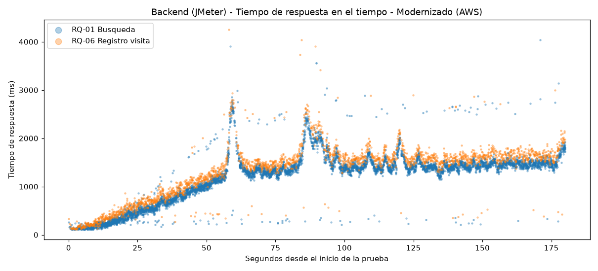
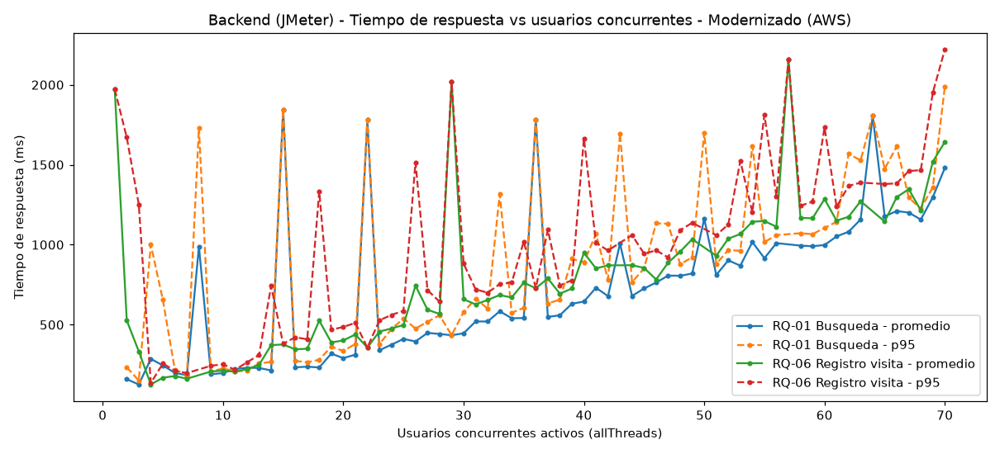
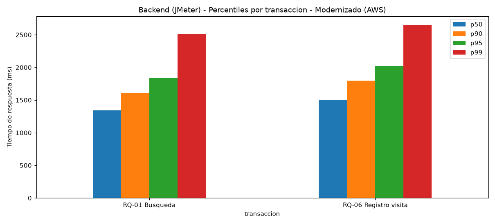
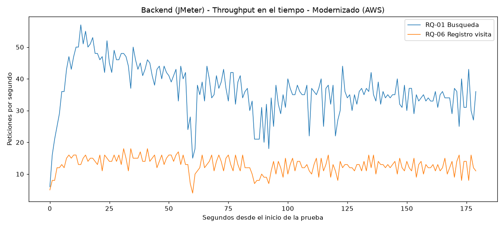
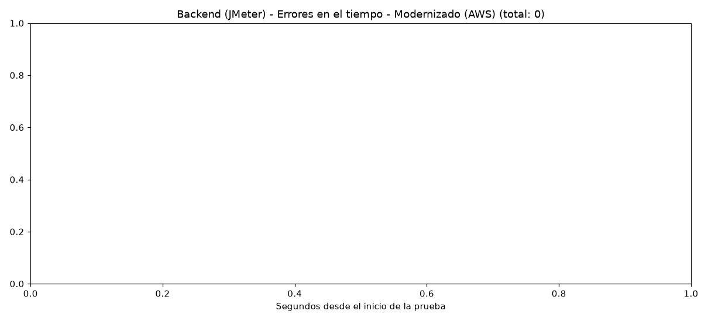
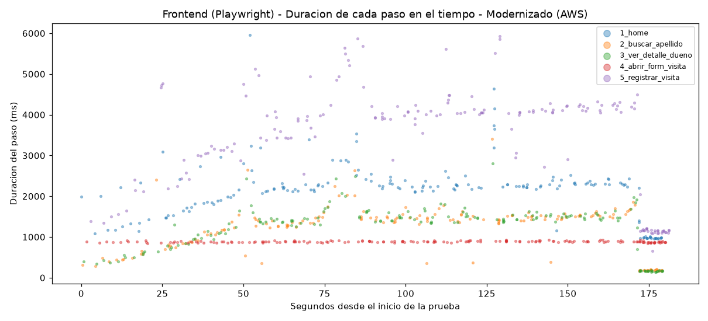
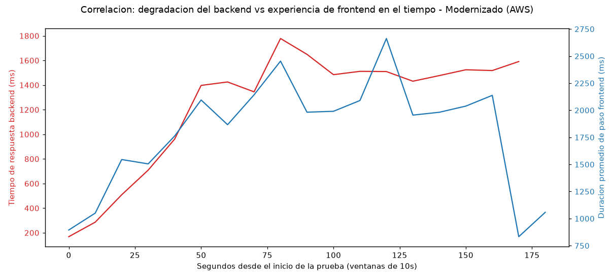

# Resultados y análisis — Corrida en PARALELO (JMeter + Playwright) sobre Spring PetClinic (Modernizado, AWS)

## 1. Qué se probó

Se ejecutaron **al mismo tiempo**:

- **JMeter** atacando directamente la API REST del backend (`petclinic_load_test_modernizado.jmx`): RQ-01 búsqueda por apellido (`GET /api/owners`), RQ-06 registro de visita (`POST /api/owners/{ownerId}/pets/{petId}/visits`, JSON).
- **Playwright** (`playwright_stress_test_modernizado.js`) navegando la SPA de React real con 10 usuarios (navegadores), ramp-up de 60s y duración de 180s.

Ambas herramientas se lanzaron contra la infraestructura real desplegada en AWS con Terraform:

- Backend: instancia EC2 `t3.medium` (`3.224.117.182`).
- Frontend: bucket S3 con *static website hosting* (`petclinic-frontend-696021927549.s3-website-us-east-1.amazonaws.com`).

Datos usados: dueña **Betty Davis** (`ownerId=2`), mascota **Basil** (`petId=2`), verificados previamente contra la API antes de correr la prueba.

**Objetivo:** aplicar la misma metodología usada en el legado (backend + frontend real bajo carga simultánea) para poder comparar ambos sistemas bajo un enfoque de ramp-up equivalente.

## 2. Resumen numérico — Backend (JMeter)

| Transacción | Peticiones | Promedio | Mediana | p90 | p95 | p99 | Máximo | Errores |
|---|---|---|---|---|---|---|---|---|
| RQ-01 Búsqueda por apellido | 6,593 | 1,151 ms | 1,343 ms | 1,612 ms | 1,833 ms | 2,515 ms | 4,043 ms | 0 |
| RQ-06 Registro de visita | 2,312 | 1,321 ms | 1,506 ms | 1,795 ms | 2,019 ms | 2,652 ms | 4,253 ms | 0 |

- **Duración total:** 180 s.
- **Errores totales:** 0.

## 3. Resumen numérico — Frontend (Playwright)

| Paso | Ejecuciones | Promedio | p95 | Errores |
|---|---|---|---|---|
| 1. Home (carga inicial de la SPA) | 174 | 2,135 ms | 3,209 ms | 0 |
| 2. Buscar por apellido (GET /api/owners) | 174 | 1,194 ms | 1,811 ms | 0 |
| 3. Ver detalle de dueño (GET /api/owners/{id}) | 174 | 1,224 ms | 1,852 ms | 0 |
| 4. Abrir formulario de visita | 174 | 885 ms | 913 ms | 0 |
| 5. Registrar visita (POST) | 174 | 3,428 ms | 5,262 ms | 0 |

- **10 usuarios (navegadores) concurrentes**, 174 iteraciones completas del flujo de 5 pasos, **0 errores** en todos los pasos.
- El paso 5 (registrar visita) es el más lento porque incluye tanto la llamada `POST` como la espera a que la nueva visita se renderice en el historial dentro de la SPA — no es solo tiempo de red.

## 4. Tiempo de respuesta del backend en el tiempo

**Lectura:** RQ-06 (registro de visita) se mantiene por encima de RQ-01 (búsqueda) en general, aunque con mayor dispersión que en una prueba local — comportamiento esperado al correr sobre una red real (variabilidad de latencia/jitter de internet además de la carga del servidor).

## 5. Tiempo de respuesta vs usuarios concurrentes (escalabilidad)

**Lectura:** se observa una tendencia de crecimiento del tiempo de respuesta a medida que aumenta la concurrencia, con picos puntuales más pronunciados que en una prueba local (atribuibles en parte al jitter de la red real). La tendencia de fondo es de degradación gradual, sin un colapso abrupto del sistema.

## 6. Percentiles por transacción

**Lectura:** el registro de visita (escritura + validación `@Future`) es consistentemente más lento que la búsqueda (lectura) en todos los percentiles, igual que en el legado.

## 7. Throughput del backend en el tiempo

**Lectura:** el throughput sube durante el ramp-up y se estabiliza, aunque en valores absolutos más bajos que en una prueba local — cada petición individual tarda más (por la latencia de red real hacia AWS), así que en la misma ventana de tiempo caben menos peticiones por hilo.

## 8. Errores del backend en el tiempo

**Lectura:** cero errores durante toda la prueba. La API REST del backend modernizado se mantuvo 100% disponible bajo la carga de hasta 70 usuarios concurrentes combinados.

## 9. Duración de los pasos de frontend en el tiempo

**Lectura:** los 5 pasos del flujo de usuario se mantienen sin fallos durante toda la prueba, con el paso de registro de visita (5) mostrando la mayor dispersión, consistente con ser la operación de escritura del flujo.

## 10. Correlación entre degradación del backend y experiencia de frontend

**Lectura:** igual que en el legado, se observa que la degradación del tiempo de respuesta del backend durante el ramp-up se refleja en pasos de navegación más lentos del lado del frontend — confirmando que la metodología combinada también es útil para observar el sistema modernizado desde ambos ángulos.

## 11. Conclusión general de esta corrida

Bajo una carga de hasta 70 usuarios concurrentes combinados (JMeter + Playwright) durante 180 segundos contra la infraestructura real en AWS, el sistema modernizado se mantuvo completamente estable: **0 errores** tanto en el backend (API REST) como en el frontend (174 flujos completos de React). Los tiempos de respuesta absolutos son más altos que los observados en una prueba local (ver `pruebas/comparacion_legado_vs_modernizado/` para la comparación directa contra el legado y la salvedad metodológica sobre la latencia de red real), pero la tendencia de escalabilidad es gradual y no se observó ningún colapso ni degradación abrupta del servicio.
